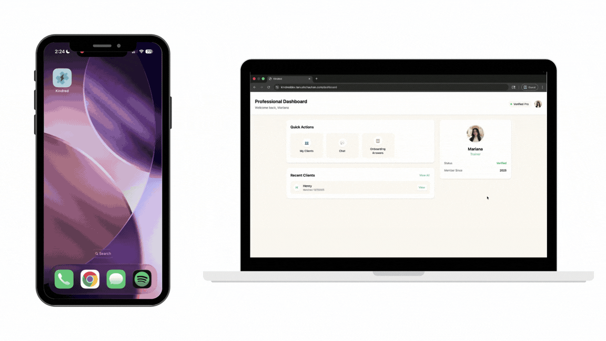

# Kindred

Kindred connects wellness clients with personal trainers and nutritionists through AI-assisted matching, shared health insights, personalized plans, and direct messaging.

<p align="center">
  <a href="https://kindreddev.tanushchauhan.com/demo"><strong>View demo</strong></a>
  ·
  <a href="https://github.com/tanushchauhan/kindred-mobile-app"><strong>Mobile app</strong></a>
  ·
  <a href="#getting-started"><strong>Getting started</strong></a>
</p>



The [interactive demo](https://kindreddev.tanushchauhan.com/demo) uses bundled sample data, requires no account, and remains available even when external services are offline.

**Stack:** Next.js 16 · TypeScript · Supabase · PostgreSQL · NVIDIA AI · Tailwind CSS · Expo · Apple HealthKit

## What Kindred does

Kindred brings clients and wellness professionals into one connected platform:

- **AI-assisted matching:** Uses profile embeddings and NVIDIA-hosted models to recommend trainers and nutritionists, with a plain-language explanation for each suggestion.
- **Professional workspace:** Gives trainers and nutritionists a dashboard for managing clients, reviewing health trends, assigning exercise and nutrition plans, and messaging their team.
- **Mobile wellness hub:** Syncs Apple HealthKit activity and nutrition data from the companion Expo app.
- **Shared plans and conversations:** Keeps clients and multiple professionals aligned around the same goals, progress, and messages.

## How the matching flow works

1. Professional profile data is converted into vector embeddings through the admin embedding endpoint.
2. Client goals are embedded and compared against verified professionals using Supabase vector-search functions.
3. The strongest candidates are evaluated by an NVIDIA-hosted language model.
4. The API returns recommended professionals and an explanation of the match.

## Repository map

Kindred is split into two focused repositories:

- **This repository:** Next.js professional portal, web experience, and API.
- **[kindred-mobile-app](https://github.com/tanushchauhan/kindred-mobile-app):** Expo/React Native client, HealthKit integration, matching, plans, and chat.

```text
kindred-web/
├── app/
│   ├── api/                 # Mobile and web API routes
│   ├── admin/               # Platform administration
│   ├── dashboard/           # Client web experience
│   └── professionals/       # Professional portal
├── lib/                     # Supabase clients, auth, and shared types
├── public/                  # Static assets
└── docs/                    # README media
```

## Getting started

### Prerequisites

- Node.js 20.9 or newer
- npm
- A configured Supabase project
- An NVIDIA API key for AI matching and embedding generation

### 1. Install dependencies

```bash
npm ci
```

### 2. Configure service keys

Copy the example environment file:

```bash
cp .env.example .env.local
```

Fill in the credentials for your configured Supabase and NVIDIA projects:

```env
NEXT_PUBLIC_SUPABASE_URL=
NEXT_PUBLIC_SUPABASE_ANON_KEY=
SUPABASE_SERVICE_ROLE_KEY=
NVIDIA_API_KEY=
```

`SUPABASE_SERVICE_ROLE_KEY` and `NVIDIA_API_KEY` are server-only credentials. Never expose them in browser or mobile code.

The application expects an existing Kindred-compatible Supabase schema, including its row-level security policies, vector-search functions, and `avatars` storage bucket.

### 3. Start the application

```bash
npm run dev
```

Open [http://localhost:3000](http://localhost:3000).

## Useful commands

```bash
npm run dev       # Start the development server
npm run build     # Create a production build
npm run start     # Run the production build
npm run lint      # Run ESLint
```

## Project background

Kindred was built by a multidisciplinary team for the [Texas Convergent](https://txconvergent.org/) Fall 2025 cohort.

## License

Kindred is available under the [MIT License](LICENSE).
